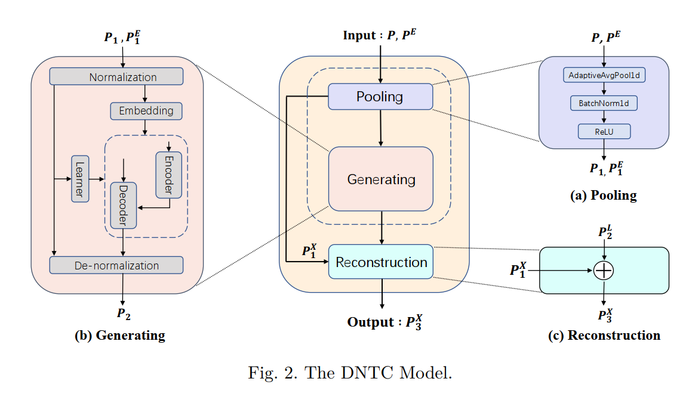
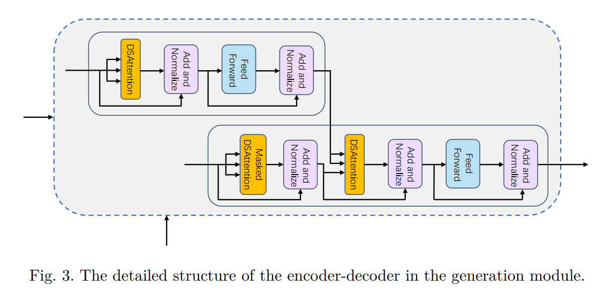
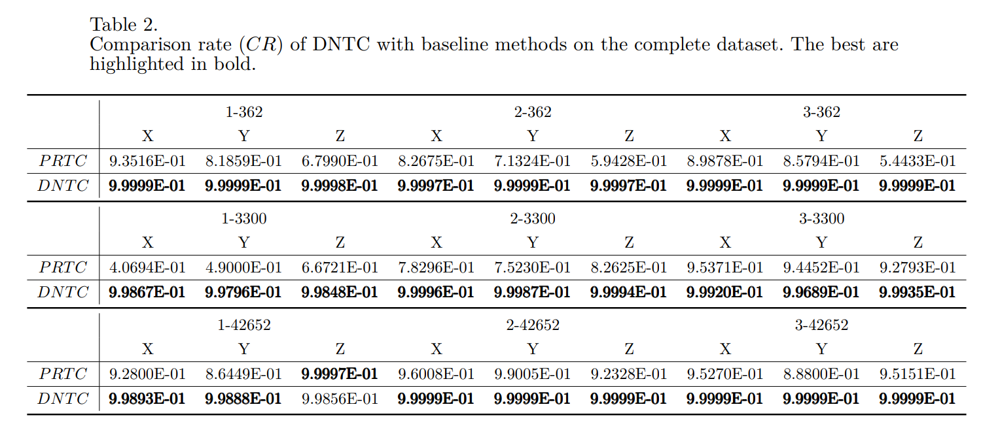
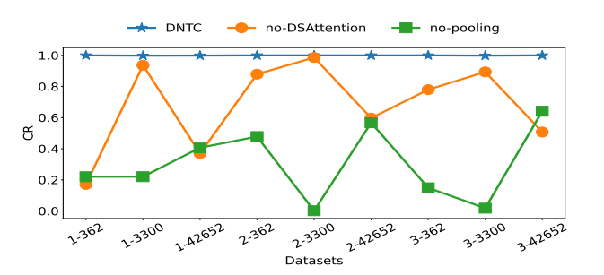

# Temperature-Compensation

This is the codebase for the paper: DNTC: An Unsupervised Deep Networks for Temperature Compensation in Non-stationary Data.

## Architecture





### Pooling module

The pooling module incorporates three essential components: Adaptive Average Pooling (AdaptiveAvgPool), Batch Normalization (BatchNorm), and Rectified Linear Unit (ReLU).

### Generation module

The generation module is a Non-stationary Transformer, the input features or sequences undergo multiple transformations of De-stationary Attention. 

### Reconstruction module

Its input is provided by both the pooling module and the generation module. This module performs a simple interactive learning operation, and the final reconstructed output provides the compensation signal we need.

## Preparation


1. Install Python 3.9 and neccessary dependencies.
```
pip install -r requirements.txt
```
2. All the 9 datasets can be obtained from [Baidu Cloud](https://pan.baidu.com/s/1a_rOrDzE6Jnjm1KrJYteSQ), Extracting code: i5uu.


## Experiment Results

### Main Results

For multivariate compensation results, comparison rate CR of DNTC with baseline methods on the complete dataset.



### Ablation studies

To evaluate the role of each component in our proposed compensation framework, we removed or replaced the corresponding components and observed how these variations affect the compensation performance on each dataset.




## Contact

If you have any questions or want to use the code, please contact 1437616324@qq.com.

## Acknowledgement

This repo is built on the [Nonstationary_Transformers repo](https://github.com/thuml/Nonstationary_Transformers), we appreciate the authors a lot for their valuable code and efforts.


